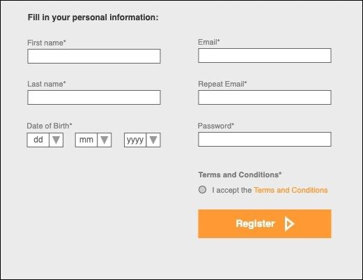

1. Write the list of test cases for the given user story specifying per test case: description, steps and assertions. You can use any methodology you want (e.g. Gherkin).

As a user I want to create a new user’s account.

The form to be filled in by the user to get successfully registered should contain the following mandatory fields: Mandatory fields:

First Name: string between 4 and 150 characters Last Name: string between 4 and 150 characters Date of Birth: dd/mm/YYYY

Email: string no longer than 150 characters Repeat Email: string no longer than 150 characters Password: string between 6 and 20 characters Terms and conditions: checkbox

Acceptance Criteria:

1. If the user enters an email address already registered in the system, he should be redirected to the login page with a message saying: "There is an existing account associated with <<EMAIL_ADDRESS>>”.
2. Email address should be valid. If it is not a valid email address, an error message should be displayed below the corresponding text box saying: “Invalid email.”

All mandatory fields should be filled in when clicking on “Register”. Otherwise, an error message should be displayed below the corresponding text box saying: "Please fill in this <>".

4. If the date of birth selected by the user exceeds the current date, an error message should be displayed saying: "Selected date exceeds the current date."
5. When a user clicks on "Register" he should be redirected to a page with a message saying that he needs to activate his account (see Figure 2). At this point, the user should receive an email that contains an activation link.
6. If the user activates his account (click on the activation link from the email) in the same browser where he completed the registration, he should be automatically logged in the system.
7. If the user activates his account from a different browser, the user should be redirected to the login page with a welcome message and the email address pre-populated.

Please refer to the images attached for the design.

